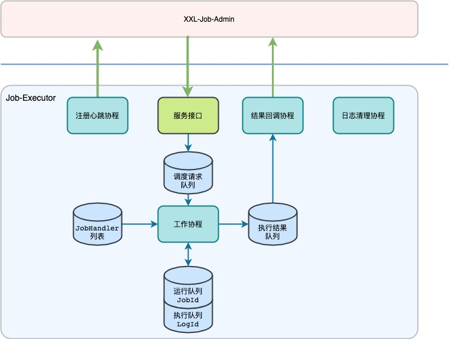

# go-xxl-executor

## 1. 已支持特性
* 提供调度中心需要的API：心跳检测、空闲检测、运行任务、终止任务、实时日志
* 支持心跳上报、启动时向调度中心注册、退出时注销
* 支持阻塞处理策略
* 支持任务超时，手动终止任务
* 支持日志定期清理

## 2. 怎么用
> 可参考使用样例
> [https://github.com/PGshen/go-executor-example](https://github.com/PGshen/go-executor-example)
### 步骤
1. mod引入go-xxl-executor包
```shell
require github.com/PGshen/go-xxl-executor v1.0.1
```

2. 开发JobHandler业务逻辑
```go
type ExampleJobHandler struct {
	handler.MethodJobHandler
}

func (receiver *ExampleJobHandler) Execute(param handler.Param) biz.ReturnT {
	receiver.MethodJobHandler.Execute(param)
	common.Log.Info("Test...")
	return biz.NewReturnT(common.SuccessCode, "Test JobHandler")
}
```

3.  初始化配置
```go
xxlJobConfig := executor.XxlJobConfig{
    Env:              "dev",
    AdminAddress:     "http://127.0.0.1:8080/xxl-job-admin",
    AccessToken:      "",
    Appname:          "go-executor-sample",
    Address:          "",
    Ip:               "",
    Port:             9997,
    LogPath:          "/Users/shen/Me/Study/Operation/Go/go-executor-example/log",
    LogRetentionDays: 7,
    HttpTimeout:      5,
}
```

4. 注册JobHandler到执行器并启动
```go
// 注册JobHandler， name跟admin上的配置的JobHandler一致
_ = handler.AddJobHandler("test", &app.ExampleJobHandler{})
// 在实例化executor之前不可使用common.Log打印日志，因为还未读取到配置，也就还没初始化logger
xxlExecutor := executor.NewXxlJobExecutor(xxlJobConfig)
xxlExecutor.Start() // 启动执行器服务
```

5. 在xxl-job-admin上添加执行器，然后添加任务

## 3. 目录结构
```shell
(base) ➜  go-xxl-executor git:(master) ✗ tree -L 2
.
├── README.md
├── biz
│   ├── admin_biz.go                        # 调用调度中心接口的处理
│   ├── executor_biz.go                     # 执行器接口入口逻辑
│   ├── global_value.go                     # 全局变量，主要是各个队列及操作队列的方法
│   ├── model                               # model参数结构体
│   └── return_t.go                         # 接口统一返回结构
├── common
│   ├── const_value.go                      # 静态常量
│   ├── log                                 # 日志包
│   ├── logger.go                           # 日志
│   └── util.go                             # 工具方法
├── executor
│   ├── xxl_job_config.go                   # 执行器的配置项
│   └── xxl_job_executor.go                 # 执行器，初始化并启动各个协程
├── go.mod                                  # go mod
├── goroutine
│   ├── executor_callback.go                # 结果回调协程
│   ├── executor_cleanlog.go                # 日志清理协程
│   ├── executor_registry.go                # 注册协程
│   └── executor_worker.go                  # 工作协程，主要的逻辑
├── handler
│   └── job_handler.go                      # JobHandler接口定义及实现
└── server
    └── executor_api.go                     # executor提供的API
```

## 4. 整体流程
#### 主要流程
1. executor_api接收调度请求，将调度请求转为任务放入调度请求队列后，马上响应调度中心
2. executor_worker通过轮询从调度请求队列获取任务，启动新的协程，找到相应的JobHandler后开始执行任务逻辑，执行完成后将执行结果放入队列
3. executor_callback通过轮询从执行结果队列获取结果，然后调用调度中心的接口通知任务的执行结果



> 上面是主要流程，手工kill或者超时也会导致任务终止

## 5. 主要逻辑
### 5.1 5个重要全局队列(集合)
```shell
JobHandlerRegistry = make(map[string]IJobHandler)                             // JobHandler列表,注册任务的时候会记录到这个列表里,key为jobHandler名称（这个和admin配置的JobHandler一致）,value为对应实现
DispatchReqQueue  = DispatchReq{JobTaskQueueMap: make(map[int]*TaskQueue)}    // 调度请求队列 key为jobId, value为这个jobId对应的待执行任务队列
ExecutionRetQueue = RetQueue{TodoCallbackRets: []model.HandleCallbackParam{}} // 执行结果队列 key为JobId，value为这个jobId对应的待执行执行集合
RunningList       = Running{RunningContextMap: make(map[int]*RunningContext)} // 运行队列，key为JobId（同一时间一个jobId对应的任务在执行，所以key不是logId,并且也为了方便做空闲检测）,value为这个jobId对应执行上下文(context和CancelFunc),目的是为了支持手动终止
TriggerLogIdSet   = LogIdSet{LogIdSet: map[int64]int64{}}                     // 触发ID，即logId集合，目的是避免重复触发和重复回调
```
> 由于这些全局信息会被多个协程操作，所以都会带上锁


### 5.2 工作协程流程
1. `[GetDispatchReqFromQueue]`从DispatchReqQueue获取一个未被协程领取的调度请求（以jobId为单位）**// 由于锁的问题，判断逻辑略显别扭**
2. `[StartWorker]`给队列上锁，判断当前任务队列是否在运行中，如果没有并且任务数大于0，那么启动一个协程，否则跳过；最后解锁 **// 为了提高性能，DispatchReqQueue包含两次锁，第一次使用的外层锁，所以获取到的调度请求仍然可能被其他协程抢先领取占用，所以这里使用内部锁再次判断确保不被重复领取**
3. `[doTask]`子协程轮询当前jobId的任务队列,触发任务(第4步)，直到所有任务完成，最后尝试将当前jobId从DispatchReqQueue中移除 **// 任务跑完后将jobId移除是为了防止jobId堆积，因为有些jobId可能跑完再也用不上了**
4. `[trigger]`根据任务时候有超时使用不同的context,然后将context保存到运行队列集合中，然后启动一个子协程跑任务(第5步)，通过`select: <-ctx.Done`阻塞等待子协程退出或者是ctx被cancel了，根据ctx.Err()来判断是那种原因导致ctx.Done  **// 这里使用子协程来跑实际任务是为了支持超时和手动kill，如果不是子协程跑的话那么无法`终止`当前任务**
5. `[execTask]`封装参数，然后调用JobHandler接口的实现，即自己的jobHandler业务逻辑 **// 正常执行完任务也需要调用cancel,因为父协程通过`ctx.Done`来阻塞的**
> 手动kill时，通过运行队列RunningList拿到context和cancel方法，然乎调用cancel即可ctx.Done完成；超时有context自动完成，最终也会ctx.Done.
> 这也是为什么使用`select: <-ctx.Done`阻塞的原因

### 5.3 手动kill和超时怎么实现
主要是借助context来实现的，开始任务前将context信息保存到运行队列，接着启动新的协程执行任务，通过`select {case <-ctx.Done():...`进行阻塞，如果任务超时或者手动kill任务时，通过cancel来达到取消的目的，从而使协程不必等待子协程而继续运行,具体实现可查看`executor_worker.trigger()`函数
> 这里需要注意的是，其实我们并没有真正的终止子协程的运行，只是父协程不阻塞等待子协程完成而继续执行而已。由于go没有提供相关的机制，目前没有找到比较好的方法处理这种问题，如果有好的想法欢迎探讨。